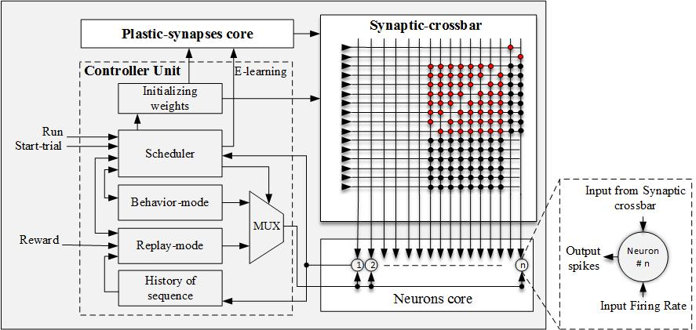
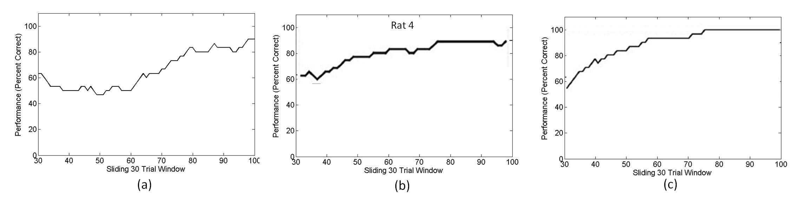
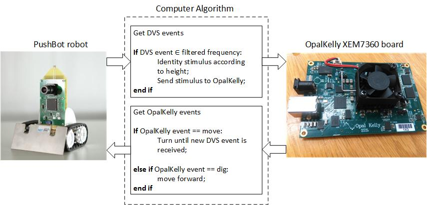

# snn-with-reinforcement-learning

FPGA implementation of spiking neural networks with on-chip on-line reinforcemnet learning capability

## Summary

Highly efficient performance-resources trade-off of the biological brain is a motivation for research on neuromorphic computing. Neuromorphic engineers develop event-based spiking neural networks (SNNs) in hardware. Learning in SNNs is a challenging topic of current research. Reinforcement learning (RL) is a particularly promising learning paradigm, important for developing autonomous agents. In this paper, we propose a digital multiplier-less hardware implementation of an SNN with RL capability. The network is able to learn stimulus-response associations in a context-dependent learning task. Validated in a robotic experiment, the proposed model replicates the behavior in animal experiments and the respective computational model.

Fig. 1: System level architecture of the digital multiplier-less event-driven SNN with reinforcement learning capability.

## Results

The proposed digital spike-based neural network with RL capability is described using the standard top-bottom digital ASIC design flow with separate fully-synthesizable synchronous modules. As a multiplier is a high-cost core in terms of area utilization and power consumption, the proposed architecture does not contain any multipliers. In order to achieve a fair balance between accuracy and cost, the proposed spiking neural network model performs data transformation using 32-bit fixed-point numbers with 31 fractional bits. To minimize silicon area utilization, neuron and synapse blocks are designed as simply as possible.

We propose an event-driven hardware model which is able to learn the same task as in the biological experiments and previous computational studies, within 100 trials.
The proposed network with randomly initialized synaptic weights is simulated using the Xilinx Vivado Design suite.
Performance within 80 $ \% $ to 90 $ \% $ was reached (see Fig.6(a)). As shown in Fig.~\ref{performanc}(b), the experimental study of the context-dependant task was learned in about 100 trials where rats reached about 80$ \% $ to 90$ \% $ correct behavioral response~\cite{Komo2009}. The computational model was able to learn the task in 100 trials with a mean of 80$ \% $ to 90$ \% $ correct detection rate~\cite{flor2014} (Fig.~\ref{performanc}(c)). Thus, the proposed digital event-driven network shows a performance that is more similar to animal behavior in the experiment.

Fig. 6: Behavioral performance during successful learning of the context-dependent task: (a) The proposed digital event-driven hardware model. (b) The animal experiment [19]. (c) The computational model [17]

## Robotic experiment
In order to verify the proposed system, we interfaced the digital neuromorphic system on FPGA to a neuromorphic dynamic vision sensor (DVS) mounted on a robotic vehicle and developed an autonomous neuromorphic agent that is able to learn the context-dependent task. As shown in Fig.5, the experimental setup used in this work consists of the Pushbot robotic vehicle with an embedded DVS camera (eDVS~\cite{Conradt2009}) and the Opallkelly XEM7360 board. Furthermore, a computer is used to direct the flow of events between the robot and the SNN on FPGA. The computer runs a simple program that manages the stream of events between the neuromorphic system on FPGA and the robot. The supplementary movie shows the robot's behavior during the first trials and also after complete training {Shared video: https://www.dropbox.com/s/vokdma10j5z763m/experiment-clip.mp4?dl=0}.

## References
